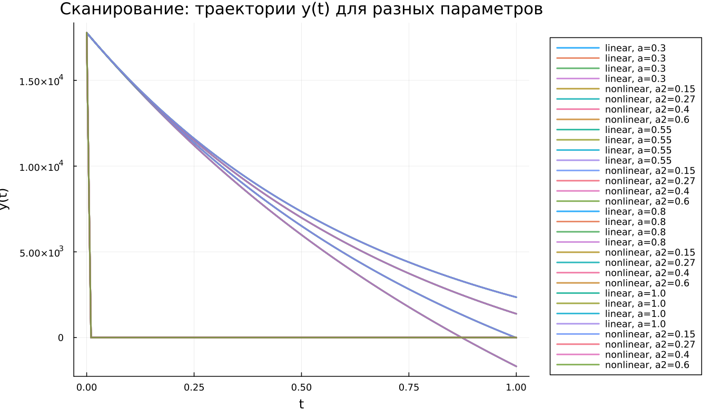

---
## Author
author:
  name: Хамди Мохаммад
  email: 1032235868@rudn.ru
  affiliation:
    - name: Российский университет дружбы народов
      country: Российская Федерация
      postal-code: 117198
      city: Москва
      address: ул. Миклухо-Маклая, д. 6

## Title
title: "Математическое моделирование"
subtitle: "Лабораторная работа № 3"
license: "CC BY"
---

# Цель работы

В данной работе рассматриваются базовые математические модели боевых действий, известные как модели Ланчестера. Эти модели применяются для описания противостояния различных военных формирований — как регулярных армий, так и нерегулярных (например, партизанских отрядов).  

Основной характеристикой каждой стороны является её численность. Если в некоторый момент времени численность одной из сторон становится равной нулю, считается, что она потерпела поражение, при условии, что численность противника остаётся положительной.

# Задание

1. Рассмотреть три варианта моделей Ланчестера.  
2. Построить графики изменения численности противоборствующих сторон.  
3. Определить, какая сторона одерживает победу в каждом случае.

# Выполнение лабораторной работы

## Теоретические сведения

Рассмотрим три возможных типа военного противостояния:

1. Конфликт между регулярными армиями.  
2. Конфликт между регулярными войсками и партизанскими формированиями.  
3. Противоборство между партизанскими группировками.

### Модель регулярных армий

Изменение численности регулярных войск определяется несколькими факторами:

1. естественное уменьшение численности армии (болезни, травмы, дезертирство и другие причины, не связанные напрямую с боевыми действиями);
2. потери в результате боевых столкновений;
3. поступление подкреплений.

В этом случае динамика численности армий описывается системой дифференциальных уравнений

$$
\begin{cases}
\frac{dx}{dt}= -a(t)x(t) - b(t)y(t) + P(t) \\
\frac{dy}{dt}= -c(t)x(t) - h(t)y(t) + Q(t)
\end{cases}
$$

Слагаемые $-a(t)x(t)$ и $-h(t)y(t)$ характеризуют потери, не связанные с непосредственным боем.  
Члены $-b(t)y(t)$ и $-c(t)x(t)$ отражают боевые потери.  

Коэффициенты $b(t)$ и $c(t)$ определяют эффективность ведения боевых действий соответствующими сторонами.  
Параметры $a(t)$ и $h(t)$ описывают влияние прочих факторов, уменьшающих численность войск.  

Функции $P(t)$ и $Q(t)$ задают скорость поступления подкреплений.

---

### Модель регулярной армии и партизан

Если в конфликте участвуют партизанские формирования, характер боевых действий изменяется. Нерегулярные силы действуют скрытно, поэтому противник вынужден воздействовать на значительные территории, где могут находиться партизаны.

В результате скорость потерь партизан зависит как от численности регулярной армии, так и от их собственной численности.

Математическая модель принимает следующий вид:

$$
\begin{cases}
\frac{dx}{dt}= -a(t)x(t) - b(t)y(t) + P(t) \\
\frac{dy}{dt}= -c(t)x(t)y(t) - h(t)y(t) + Q(t)
\end{cases}
$$

---

### Модель партизанских формирований

Если обе стороны представлены нерегулярными отрядами, то с учётом предыдущих предположений система уравнений записывается следующим образом:

$$
\begin{cases}
\frac{dx}{dt}= -a(t)x(t) - b(t)x(t)y(t) + P(t) \\
\frac{dy}{dt}= -h(t)y(t) - c(t)x(t)y(t) + Q(t)
\end{cases}
$$

---

### Упрощённая модель Ланчестера

В наиболее простой модели предполагается, что коэффициенты эффективности боя постоянны. Это означает, что один солдат армии $x$ уничтожает за единицу времени $c$ солдат армии $y$, а один солдат армии $y$ — $b$ солдат армии $x$.

При этом не учитываются подкрепления и потери, не связанные с боем.

Тогда система уравнений имеет вид

$$
\begin{cases}
\frac{dx}{dt}= -by \\
\frac{dy}{dt}= -ax
\end{cases}
$$

Эта система допускает точное аналитическое решение.

Разделив уравнения, получаем

$$
\frac{dx}{dy}=\frac{by}{cx}
$$

После интегрирования

$$
cxdx = bydy
$$

и, следовательно,

$$
cx^2 - by^2 = C
$$

Таким образом, изменение численности армий происходит вдоль гиперболы, задаваемой этим уравнением (рис. -@fig:001).

{ #fig:001 width=70% height=70% }

Гиперболы разделяются прямой

$$
\sqrt{cx}=\sqrt{by}
$$

Если начальная точка находится выше этой линии, то численность армии $x$ со временем обращается в нуль и победу одерживает армия $y$.  

Если же начальная точка расположена ниже разделяющей прямой, победителем оказывается армия $x$.  

В случае, когда начальное состояние лежит на этой прямой, обе армии постепенно истощаются, однако полное уничтожение происходит лишь за бесконечное время.

Модель показывает важный результат: для борьбы с противником, численность которого в два раза больше, требуется оружие примерно в четыре раза эффективнее. При трёхкратном превосходстве противника необходимо уже девятикратное превосходство в эффективности вооружения.

Следует отметить, что данная модель является сильно упрощённой и служит лишь для первичного анализа.

---

### Упрощённая модель регулярной армии и партизан

Если рассмотреть второй тип конфликта при тех же упрощениях, система принимает вид

$$
\begin{cases}
\frac{dx}{dt}= -by(t) \\
\frac{dy}{dt}= -cx(t)y(t)
\end{cases}
$$

Эта система сводится к интегралу движения

$$
\frac{d}{dt}\left(\frac{b}{2}x^2(t)-cy(t)\right)=0
$$

Следовательно,

$$
\frac{b}{2}x^2(t)-cy(t)=\frac{b}{2}x^2(0)-cy(0)=C_1
$$

{ #fig:002 width=70% height=70% }

Из рисунка @fig:002 следует:

- если $C_1>0$, победу одерживает регулярная армия;
- если $C_1<0$, побеждают партизанские формирования.

Победа определяется не только исходной численностью, но и эффективностью вооружения и боевой подготовкой.

Условие победы регулярной армии:

$$
\frac{b}{2}x^2(0)>cy(0)
$$

Таким образом, для достижения успеха партизанам необходимо увеличить коэффициент эффективности $c$ и повысить свою численность. Причём требуемое увеличение численности должно расти пропорционально квадрату численности регулярной армии.

Это указывает на преимущество регулярных войск в подобных конфликтах.

Рассмотренные модели представляют собой системы обыкновенных дифференциальных уравнений второго порядка, которые широко применяются при математическом описании динамических процессов в естественных науках.

---

## Задача

Между страной $X$ и страной $Y$ происходит вооружённый конфликт. Численность их армий изменяется со временем и описывается функциями $x(t)$ и $y(t)$.

В начальный момент времени:

- страна $X$ располагает армией численностью **32888** человек;
- страна $Y$ имеет **17777** военнослужащих.

Предположим, что коэффициенты $a$, $b$, $c$, $h$ постоянны, а функции подкреплений $P(t)$ и $Q(t)$ являются непрерывными.

Требуется построить графики изменения численности армий в следующих случаях.

### 1. Модель регулярных армий

$$
\begin{cases}
\frac{dx}{dt}= -0.55x(t) - 0.77y(t) + 1.5\sin(3t+1) \\
\frac{dy}{dt}= -0.66x(t) - 0.44y(t) + 1.2\cos(t+1)
\end{cases}
$$

### 2. Модель регулярной армии и партизан

$$
\begin{cases}
\frac{dx}{dt}= -0.27x(t) - 0.88y(t) + \sin(20t) \\
\frac{dy}{dt}= -0.68x(t)y(t) - 0.37y(t) + \cos(10t)
\end{cases}
$$

Для численного моделирования и построения графиков были использованы внешние файлы с программным кодом:





---

# Базовые эксперименты

## Линейная модель (model_type = linear)

График отражает изменение переменных $x(t)$ и $y(t)$ во времени для линейной системы.

Обе функции уменьшаются по мере роста времени.

Переменная $x(t)$ убывает постепенно и остаётся положительной на протяжении всего рассматриваемого интервала. Это говорит о плавном снижении состояния системы без резких изменений.

Переменная $y(t)$ уменьшается быстрее и к концу интервала становится близкой к нулю. Такое поведение характерно для линейных систем, решения которых стремятся к устойчивому состоянию экспоненциальным образом.

В целом линейная модель демонстрирует стабильную и предсказуемую динамику.

---

## Нелинейная модель (model_type = nonlinear)

В нелинейной системе наблюдается иная динамика.

Переменная $x(t)$ уменьшается медленнее и сохраняет сравнительно высокие значения на протяжении всего интервала.

Переменная $y(t)$ практически сразу стремится к нулю и далее остаётся около этого значения.

Такой результат связан с присутствием нелинейных членов, которые резко ускоряют уменьшение одной из переменных. После этого динамика системы определяется преимущественно поведением функции $x(t)$.

---

# Параметрическое сканирование

## Траектории $x(t)$ для различных параметров

Было проведено исследование влияния параметров модели.

Для линейной системы изменялся параметр $a$, а для нелинейной — параметр $a_2$.

Из графика следует, что увеличение параметра ускоряет уменьшение функции $x(t)$.

Основные наблюдения:

- при малых значениях параметра функция уменьшается медленно;
- при увеличении параметра кривая становится более крутой;
- различия между траекториями заметны уже в середине интервала.

В нелинейной системе влияние параметров также присутствует, однако форма кривых усложняется из-за нелинейности модели.

---

## Траектории $y(t)$ для различных параметров

Аналогичное исследование проведено для функции $y(t)$.

В линейной системе увеличение параметра ускоряет уменьшение переменной, и её значение быстрее приближается к нулю.

В нелинейной системе поведение отличается: переменная $y(t)$ практически сразу становится равной нулю независимо от параметра.

Это говорит о сильном подавляющем влиянии нелинейных членов.

---

# Время вычислений

Проведено сравнение времени численного решения системы дифференциальных уравнений.

Результаты показывают:

- линейная система решается значительно быстрее;
- время вычисления линейной модели составляет порядка $10^{-5}$ секунд;
- для нелинейной модели время увеличивается до $7\cdot10^{-4}$–$9\cdot10^{-4}$ секунд.

Несмотря на это, абсолютные значения времени остаются очень малыми и не создают ограничений для вычислений.

---

# Анализ итоговой метрики norm_final

В качестве итогового показателя использовалась метрика

$$
\text{norm\_final}=\sqrt{x(t_{final})^2+y(t_{final})^2}
$$

Она характеризует величину состояния системы в конце моделирования.

Анализ показывает:

- при увеличении параметра значение метрики уменьшается;
- линейная система быстрее приближается к состоянию покоя;
- нелинейная система сохраняет более высокие значения метрики.

Это означает, что в линейной модели затухание происходит быстрее.

---

# Выводы

1. Линейная модель характеризуется плавным уменьшением переменных. Функции $x(t)$ и $y(t)$ монотонно убывают, причём $y(t)$ стремится к нулю быстрее.

2. Нелинейная модель демонстрирует иную динамику: переменная $y(t)$ быстро исчезает, после чего система фактически определяется поведением $x(t)$.

3. Параметры системы существенно влияют на скорость убывания решений. При их увеличении траектории становятся более крутыми.

4. В нелинейной системе влияние параметров на $y(t)$ оказывается незначительным из-за быстрого подавления этой переменной.

5. Численные эксперименты показывают, что линейная модель требует меньше вычислительных ресурсов, однако даже для нелинейной системы время расчёта остаётся крайне малым.

6. Итоговая метрика $\text{norm\_final}$ уменьшается при увеличении параметров, что свидетельствует об усилении затухания динамики.

Полученные результаты согласуются с ожидаемыми свойствами линейных и нелинейных дифференциальных систем и подтверждают корректность выполненного моделирования.

---

# Список литературы {.unnumbered}

1. https://ru.wikipedia.org/wiki/Законы_Осипова_—_Ланчестера  
2. https://zen.yandex.ru/media/id/5fd3c685994c494848984b63/differencialnye-uravneniia-dinamiki-boia-5fd4bcc45a2c8e1f2cc208f1  
3. https://intuit.ru/studies/educational_groups/594/courses/499/lecture/11353?page=7
