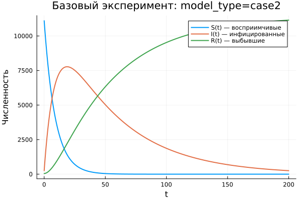

---
author:
  name: Хамди Мохаммад
  email: 1032235868@rudn.ru
  affiliation:
    - name: Российский университет дружбы народов
      country: Российская Федерация
      city: Москва
title: "Математическое моделирование"
subtitle: "Лабораторная работа № 6"
license: "CC BY"
date: today
date-format: "YYYY-MM-DD"
---

# Вводная часть

## Цель работы

Изучить эпидемиологическую модель SIR и исследовать, как меняется динамика распространения заболевания при различных условиях.

## Задание

1. Рассмотреть модель эпидемии.
2. Построить графики изменения численности групп $S(t)$, $I(t)$ и $R(t)$.
3. Проанализировать два режима:
   - $I(0) \leq I^*$;
   - $I(0) > I^*$.
4. Провести параметрическое исследование.
5. Сравнить полученные модели по графикам и численным метрикам.

# Теоретические сведения

## Модель SIR

В модели SIR вся популяция разделяется на три основные группы:

- $S(t)$ — восприимчивые к заболеванию;
- $I(t)$ — инфицированные и распространяющие болезнь;
- $R(t)$ — выздоровевшие, имеющие иммунитет.

Общая численность популяции задаётся выражением:

$$
N = S(t) + I(t) + R(t).
$$

## Смысл модели

Модель описывает последовательный переход особей между группами:

$$
S \rightarrow I \rightarrow R.
$$

Сначала восприимчивые особи заражаются и переходят в группу инфицированных. Затем инфицированные выздоравливают и переходят в группу $R$.

## Условие изоляции

До достижения критического значения $I^*$ будем считать, что инфицированные изолированы и не заражают здоровых особей.

Если выполняется условие

$$
I(t) \leq I^*,
$$

то новые заражения не происходят.

Если же

$$
I(t) > I^*,
$$

то инфицированные начинают передавать заболевание восприимчивым особям.

## Уравнение для $S(t)$

Скорость изменения числа восприимчивых определяется следующим образом:

$$
\frac{dS}{dt} =
\begin{cases}
-\alpha S, & I(t) > I^*, \\
0, & I(t) \leq I^*.
\end{cases}
$$

## Уравнение для $I(t)$

Динамика числа инфицированных задаётся уравнением:

$$
\frac{dI}{dt} =
\begin{cases}
\alpha S - \beta I, & I(t) > I^*, \\
-\beta I, & I(t) \leq I^*.
\end{cases}
$$

## Уравнение для $R(t)$

Число выздоровевших изменяется по закону:

$$
\frac{dR}{dt} = \beta I.
$$

Параметры модели имеют следующий смысл:

- $\alpha$ — коэффициент заражения;
- $\beta$ — коэффициент выздоровления.

# Постановка задачи

## Исходные данные

На острове началась эпидемия.

Известны следующие данные:

$$
N = 11400,
$$

$$
I(0) = 250,
$$

$$
R(0) = 47.
$$

## Начальное число восприимчивых

Количество восприимчивых к заболеванию людей в момент $t=0$ вычисляется по формуле:

$$
S(0) = N - I(0) - R(0).
$$

После подстановки исходных данных получаем:

$$
S(0) = 11400 - 250 - 47 = 11103.
$$

## Рассматриваемые случаи

В работе исследуются два варианта развития эпидемии:

1. $I(0) \leq I^*$ — начальное число заболевших не превышает критический уровень.
2. $I(0) > I^*$ — начальное число заболевших больше критического уровня.

# Базовые эксперименты

## Первая модель: временные зависимости

## Первая модель: фазовый портрет

## Анализ первой модели

В первой модели наблюдается поведение, которое нельзя считать типичным для классической SIR-системы:

- $S(t)$ остаётся неизменным;
- $I(t)$ растёт экспоненциально;
- $R(t)$ уменьшается и может принимать отрицательные значения;
- механизм стабилизации отсутствует.

## Вывод по первой модели

Первая модель нарушает физический смысл эпидемиологической системы.

Ключевая особенность состоит в том, что

$$
S(t) = const.
$$

Из-за этого число восприимчивых не уменьшается, а количество инфицированных продолжает расти без естественного ограничения.

# Вторая модель

## Вторая модель: временные зависимости

## Вторая модель: фазовый портрет

## Анализ второй модели

Во второй модели формируется динамика, характерная для эпидемического процесса:

- $S(t)$ монотонно уменьшается;
- $I(t)$ сначала возрастает;
- затем $I(t)$ достигает максимума;
- после пика число инфицированных снижается;
- $R(t)$ монотонно увеличивается.

## Интерпретация второй модели

На начальном этапе болезнь распространяется достаточно активно.

Затем число восприимчивых уменьшается, интенсивность заражения падает, и эпидемия постепенно затухает:

$$
I(t) \rightarrow 0.
$$

# Сравнение базовых моделей

## Качественное различие

| Характеристика | Первая модель | Вторая модель |
|---|---|---|
| $S(t)$ | остаётся постоянным | убывает |
| $I(t)$ | растёт без ограничения | имеет конечный максимум |
| $R(t)$ | может становиться отрицательным | возрастает |
| Фазовый портрет | вертикальная траектория | незамкнутая кривая |
| Физический смысл | нарушается | сохраняется |

# Параметрическое исследование

## Сканирование траекторий $S(t)$

## Анализ траекторий $S(t)$

Для первой модели:

- $S(t)$ остаётся постоянным;
- изменение параметров почти не влияет на число восприимчивых.

Для второй модели:

- $S(t)$ постепенно уменьшается;
- при увеличении параметра $a$ спад становится более быстрым.

## Сканирование траекторий $I(t)$

## Анализ траекторий $I(t)$

Первая модель:

- показывает экспоненциальное увеличение $I(t)$;
- при росте параметра $b$ увеличение становится более резким.

Вторая модель:

- описывает эпидемическую волну;
- $I(t)$ достигает пика;
- после прохождения максимума число инфицированных уменьшается.

## Сканирование траекторий $R(t)$

## Анализ траекторий $R(t)$

Первая модель:

- приводит к значениям $R(t)$, не имеющим физического смысла;
- допускает отрицательное число выздоровевших.

Вторая модель:

- показывает накопление выздоровевших;
- $R(t)$ стремится к конечному уровню.

## Фазовые траектории

## Анализ фазовых траекторий

Фазовые портреты хорошо демонстрируют отличие между моделями:

- в первой модели траектории вырождаются в вертикальные линии;
- во второй модели траектории имеют характерную форму SIR-процесса;
- сначала происходит рост $I$ при уменьшении $S$;
- затем наблюдается спад числа инфицированных.

# Анализ итоговых метрик

## Метрика norm_final

Для сравнения конечных состояний использовалась метрика:

$$
\text{norm\_final} =
\sqrt{
S(t_{final})^2 +
I(t_{final})^2 +
R(t_{final})^2
}.
$$

Она показывает величину состояния системы в конце численного моделирования.

## Зависимость norm_final от параметра

## Интерпретация norm_final

Для первой модели:

- значение метрики быстро увеличивается;
- основной причиной является экспоненциальный рост $I(t)$.

Для второй модели:

- значения метрики значительно меньше;
- система стремится к устойчивому конечному состоянию.

# Максимум инфицированных

## Зависимость $I_{max}$ от параметра

## Анализ $I_{max}$

Первая модель:

- формирует очень большие значения $I_{max}$;
- рост инфицированных ничем не ограничивается.

Вторая модель:

- даёт конечный максимум;
- величина пика зависит от параметра $a$;
- при большем $a$ максимум достигается быстрее.

# Анализ вычислений

## Время вычислений

## Интерпретация времени вычислений

Бенчмаркинг показал следующие результаты:

- обе модели решаются численно достаточно быстро;
- время вычислений имеет порядок $10^{-4}$ секунды;
- изменение параметров почти не влияет на вычислительную сложность;
- выбранный численный метод работает эффективно.

# Итоги

## Основные результаты

1. Первая модель демонстрирует нефизичную динамику.
2. В первой модели число инфицированных растёт без ограничения.
3. Вторая модель описывает реалистичную эпидемическую волну.
4. Во второй модели эпидемия постепенно затухает, а $I(t) \to 0$.
5. Фазовые портреты подтверждают качественное различие между моделями.

## Выводы

1. Модель case1 нельзя считать адекватной для описания распространения эпидемии.
2. Модель case2 соответствует логике классического SIR-процесса.
3. Параметры $a$ и $b$ заметно влияют на скорость развития эпидемии.
4. Метрики $\text{norm\_final}$ и $I_{max}$ позволяют количественно сравнить поведение моделей.
5. Численное решение обеих систем выполняется эффективно и не требует больших вычислительных затрат.

# Список литературы {.unnumbered}

1. [Конструирование эпидемиологических моделей](https://habr.com/ru/post/551682/)
2. [Зараза, гостья наша](https://nplus1.ru/material/2019/12/26/epidemic-math)
